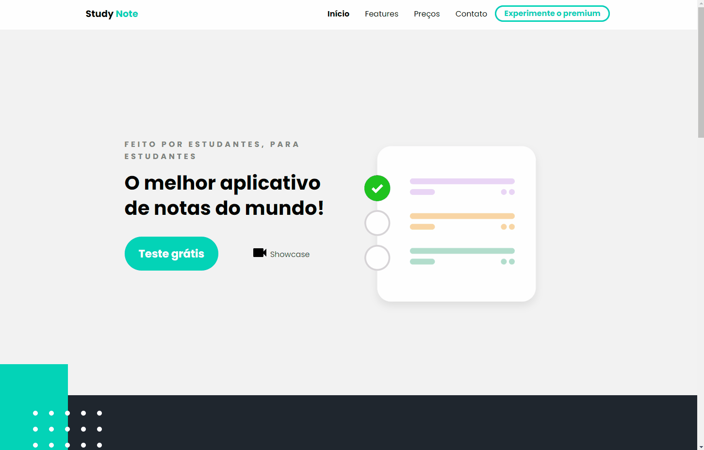

# Página Web Responsiva

Projeto com finalidade de estudo.  
Neste projeto, implementei uma pagina modelo totalmente responsiva utilizando mobile first e totalmente responsiva  
feito com o template disponibilizado pelo DesignCourse

## Tecnologias utilizadas
 - HTML
 - CSS
 - SASS
 - JavaScript
 
## Features estudadas no projeto
 - utlização de media querys para responsividade
 - mobile first 
 - estruturação HTML
 - implementação de variáveis com SASS
 
 # Preview do projeto
 ## Responsividade
 <h1 align="center">
  
 </h1>
 
 ## Mobile
 <h1 align="center">
  
 </h1>
 
 ## Médio
 <h1 align="center">
  
 </h1>
 
 ## Grande
 <h1 align="center">
  
 </h1>
